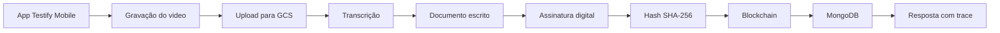

# Sprint 3 - Fluxo de integração como código

## Objetivo
Este repositório implementa, em Node.js, o fluxo de criação de testamento digital no app da Testify. O fluxo cobre exatamente as seguintes etapas:

1. gravação do video no app;
2. upload do video para o GCS;
3. transcricao;
4. criacao do documento escrito;
5. assinatura digital;
6. geracao do hash;
7. salvamento do hash em blockchain;
8. persistencia dos dados no MongoDB.

Os servicos externos sao simulados para permitir execucao local, mas o controle de qualidade continua verificando tempos, protocolos, versoes e tratamento de excecoes.

## Como a entrega responde ao barema
### Item (a): estrutura de integracao
O projeto identifica e descreve:

- camadas logicas: entrada CLI, orquestracao do fluxo, servicos integrados, rastreabilidade e repositorio;
- modulos e componentes: `createDigitalTestamentFlow`, `qualityGate`, `integrationTrace` e os servicos em `src/services`;
- servicos externos simulados: captura mobile, GCS, transcricao, geracao documental, assinatura, blockchain e MongoDB;
- hardware: smartphone do usuario, infraestrutura cloud e nos da blockchain;
- software: app Testify, runtime Node.js e APIs externas representadas por mocks;
- processos: captura, upload, transcricao, formalizacao documental, assinatura, hashing, ancoragem e persistencia.

### Item (b): controle de qualidade da integracao
O controle de qualidade esta implementado em codigo e testado automaticamente. Ele valida:

- tempos máximos por etapa e tempo total;
- protocolo usado em cada integração;
- versão registrada em cada etapa;
- status de sucesso do trace;
- tratamento padronizado de exceções;
- presença do hash SHA-256 e do recibo da blockchain.

Arquivos centrais:

- `src/config.js`
- `src/createDigitalTestamentFlow.js`
- `src/qualityGate.js`
- `src/integrationTrace.js`
- `tests/createDigitalTestamentFlow.test.js`
- `tests/qualityGate.test.js`
- `features/create-digital-testament.feature`

## Estrutura simplificada de pastas
```text
.
|-- README.md
|-- package.json
|-- features
|   `-- create-digital-testament.feature
|-- src
|   |-- cli.js
|   |-- config.js
|   |-- createDigitalTestamentFlow.js
|   |-- errors.js
|   |-- integrationTrace.js
|   |-- qualityGate.js
|   |-- testamentRecord.js
|   |-- utils.js
|   `-- services
|       |-- videoCaptureService.js
|       |-- gcsStorageService.js
|       |-- transcriptionService.js
|       |-- documentService.js
|       |-- signatureService.js
|       |-- hashService.js
|       |-- blockchainService.js
|       `-- mongoTestamentRepository.js
`-- tests
    |-- buildFlow.js
    |-- createDigitalTestamentFlow.test.js
    `-- qualityGate.test.js
```

Essa estrutura continua organizada, mas sem as camadas artificiais que o gerador anterior criou.

## Fluxo implementado
```text
App Testify Mobile
  -> gravação do video
  -> upload ao GCS
  -> transcricao
  -> geracao do documento
  -> assinatura digital
  -> hash SHA-256
  -> ancoragem em blockchain
  -> persistencia no MongoDB
  -> retorno do identificador e do trace
```



## Requisitos documentados em codigo
### Requisitos funcionais
- `RF-01`: capturar um video MP4 valido no app. Implementação em `src/services/videoCaptureService.js`.
- `RF-02`: enviar o video ao GCS. Implementação em `src/services/gcsStorageService.js`.
- `RF-03`: transcrever o video. Implementação em `src/services/transcriptionService.js`.
- `RF-04`: gerar o documento escrito. Implementação em `src/services/documentService.js`.
- `RF-05`: assinar digitalmente o documento. Implementação em `src/services/signatureService.js`.
- `RF-06`: gerar hash SHA-256. Implementação em `src/services/hashService.js`.
- `RF-07`: salvar o hash em blockchain. Implementação em `src/services/blockchainService.js`.
- `RF-08`: persistir o dossie no MongoDB. Implementação em `src/services/mongoTestamentRepository.js`.
- `RF-09`: retornar trace completo da integração. Implementação em `src/integrationTrace.js`.

### Requisitos nao funcionais
- `RNF-01`: controlar SLA por etapa e no fluxo total. Implementação em `src/config.js` e `src/qualityGate.js`.
- `RNF-02`: registrar protocolos usados. Cada passo grava `protocol` no trace.
- `RNF-03`: registrar versões usadas. Cada passo grava `version` no trace.
- `RNF-04`: padronizar exceções. Implementação em `src/errors.js`.
- `RNF-05`: garantir rastreabilidade ponta a ponta. Implementação em `src/integrationTrace.js`.
- `RNF-06`: validar integridade e recibo técnico. Implementação em `src/qualityGate.js`.

## Politicas de qualidade codificadas
As políticas usadas pelo `qualityGate` são:

| Etapa | Protocolo | Versão | SLA |
|---|---|---|---|
| Gravação do video | `APP_INTERNAL_SECURE_STORAGE` | `testify-mobile@1.0.3` | `4000 ms` |
| Upload GCS | `HTTPS/TLS 1.3` | `GCS JSON API v1` | `15000 ms` |
| Transcrição | `HTTPS/TLS 1.3` | `Speech-to-Text API v2` | `45000 ms` |
| Documento | `INTERNAL_EVENT` | `document-service@1.0.0` | `5000 ms` |
| Assinatura | `HTTPS/TLS 1.3 + CMS/PKCS#7` | `signature-service@2.1.0` | `10000 ms` |
| Hash | `INTERNAL_FUNCTION_CALL` | `sha256@1.0.0` | `1000 ms` |
| Blockchain | `JSON-RPC 2.0 over HTTPS` | `blockchain-gateway@1.3.0` | `20000 ms` |
| MongoDB | `MongoDB Wire Protocol over TLS` | `mongodb@8.0` | `5000 ms` |

Tempo maximo ponta a ponta: `120000 ms`.

## Gherkin
O arquivo `features/create-digital-testament.feature` documenta o comportamento em linguagem de negocio com tres cenarios:

1. sucesso completo;
2. falha por timeout na transcricao;
3. falha na blockchain.

## Testes que aferem a qualidade
### Integracao
- fluxo completo com sucesso;
- timeout de transcricao interrompendo a orquestracao;
- falha de blockchain com excecao padronizada;
- rejeicao de arquivo invalido.

### Qualidade
- aprovacao quando tempos, protocolos, versoes e recibo estao corretos;
- reprovacao por protocolo divergente;
- reprovacao por versao ausente;
- reprovacao por passo obrigatorio ausente no trace.

## Como executar
Requisito: Node.js 20+.

```bash
npm start
```

```bash
npm test
```

## Exemplo de saida esperada
```json
{
  "summary": {
    "testamentId": "testament_xxxxxxxx",
    "userId": "user_renato_001",
    "txHash": "0x...",
    "hash": "...",
    "quality": {
      "status": "APPROVED"
    }
  },
  "trace": {
    "steps": [
      { "name": "captureVideo", "protocol": "APP_INTERNAL_SECURE_STORAGE", "version": "testify-mobile@1.0.3" },
      { "name": "uploadVideo", "protocol": "HTTPS/TLS 1.3", "version": "GCS JSON API v1" },
      { "name": "transcribeVideo", "protocol": "HTTPS/TLS 1.3", "version": "Speech-to-Text API v2" },
      { "name": "generateDocument", "protocol": "INTERNAL_EVENT", "version": "document-service@1.0.0" },
      { "name": "signDocument", "protocol": "HTTPS/TLS 1.3 + CMS/PKCS#7", "version": "signature-service@2.1.0" },
      { "name": "generateHash", "protocol": "INTERNAL_FUNCTION_CALL", "version": "sha256@1.0.0" },
      { "name": "anchorHashOnBlockchain", "protocol": "JSON-RPC 2.0 over HTTPS", "version": "blockchain-gateway@1.3.0" },
      { "name": "saveMetadataOnMongo", "protocol": "MongoDB Wire Protocol over TLS", "version": "mongodb@8.0" }
    ]
  }
}
```

## Justificativa técnica
O uso de serviços simulados é adequado ao contexto acadêmico porque a atividade pede um fluxo de integração como código, documentado e testado. O foco aqui é deixar claros a estrutura, as regras de qualidade e o tratamento de falhas, sem depender de credenciais reais de GCP, serviços de assinatura, blockchain ou MongoDB em produção.

## Conclusão
O repositório agora está alinhado ao que o prompt pediu e ao barema: documenta requisitos em código, inclui a etapa de gravação do vídeo, descreve estrutura de integração, implementa controle de qualidade com tempos, protocolos, versões e exceções, e comprova tudo isso por Gherkin e testes automatizados.
