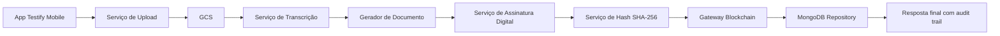

# Sprint 3 — Fluxo de integração como código

## Tema escolhido
**Criação de testamento digital no app da Testify**

Este projeto documenta e implementa, em **Node.js**, um fluxo de integração ponta a ponta para criação de um testamento digital. O fluxo cobre as seguintes etapas:

1. gravação do vídeo no app;
2. upload do vídeo para o **Google Cloud Storage (GCS)**;
3. transcrição do vídeo;
4. geração do documento escrito;
5. assinatura digital do documento;
6. geração do hash criptográfico;
7. salvamento do hash em blockchain;
8. persistência dos metadados e trilha de auditoria em **MongoDB**.

O objetivo é atender ao enunciado da Sprint 3 em duas frentes:

- **(1) Documentar os requisitos em código**;
- **(2) Aferir a qualidade dos requisitos envolvidos no sistema, ao executar estes códigos**.

---

# 1. Como este projeto responde ao enunciado

## 1.1. Item (a): identificar e descrever a estrutura de integração
O projeto descreve explicitamente:

- **camadas**;
- **módulos**;
- **componentes**;
- **serviços**;
- **hardware**;
- **software**;
- **processos**.

Tudo isso está documentado neste README e refletido na estrutura de pastas e no código.

## 1.2. Item (b): documentar e codificar o controle de qualidade da integração
O projeto implementa controle de qualidade com verificação de:

- **tempos (SLA por etapa e total)**;
- **protocolos**;
- **versões**;
- **tratamento de exceções**;
- **rastreabilidade por trace**;
- **validação de integridade do hash e da ancoragem em blockchain**.

Esse controle está codificado principalmente em:

- `src/application/services/QualityGateService.js`
- `tests/integration/*.test.js`
- `tests/quality/*.test.js`
- `features/create-digital-testament.feature`

---

# 2. Visão geral da solução técnica

## 2.1. Fluxo funcional

```text
App Testify (mobile)
   -> Upload do vídeo ao GCS
   -> Transcrição do conteúdo
   -> Geração do documento escrito
   -> Assinatura digital
   -> Geração do hash SHA-256
   -> Ancoragem do hash na blockchain
   -> Persistência dos metadados no MongoDB
   -> Retorno do identificador do testamento + trilha de auditoria
```

## 2.2. Diagrama lógico do fluxo



---

# 3. Estrutura de integração

## 3.1. Camadas arquiteturais

### A. Interface layer
Responsável por iniciar a execução do fluxo.

**Arquivo principal:**
- `src/interfaces/cli/runFlow.js`

### B. Application layer
Responsável por orquestrar o caso de uso e aplicar controle de qualidade.

**Arquivos principais:**
- `src/application/use-cases/CreateDigitalTestamentFlow.js`
- `src/application/services/QualityGateService.js`

### C. Domain layer
Responsável pelas entidades centrais e exceções do negócio.

**Arquivos principais:**
- `src/domain/entities/TestamentRecord.js`
- `src/domain/errors/IntegrationError.js`

### D. Infrastructure layer
Responsável por simular as integrações externas e a observabilidade.

**Arquivos principais:**
- `src/infrastructure/services/MockGcsStorageService.js`
- `src/infrastructure/services/MockTranscriptionService.js`
- `src/infrastructure/services/MockDocumentService.js`
- `src/infrastructure/services/MockSignatureService.js`
- `src/infrastructure/services/MockHashService.js`
- `src/infrastructure/services/MockBlockchainService.js`
- `src/infrastructure/repositories/MockMongoTestamentRepository.js`
- `src/infrastructure/observability/IntegrationTrace.js`

---

## 3.2. Módulos, componentes e serviços

| Tipo | Elemento | Responsabilidade |
|---|---|---|
| Módulo | `CreateDigitalTestamentFlow` | Orquestrar todas as etapas do fluxo |
| Módulo | `QualityGateService` | Validar tempos, protocolos, versões e status |
| Componente | `IntegrationTrace` | Registrar trace das etapas e erros |
| Serviço | `MockGcsStorageService` | Simular upload para GCS |
| Serviço | `MockTranscriptionService` | Simular transcrição do vídeo |
| Serviço | `MockDocumentService` | Simular criação do documento escrito |
| Serviço | `MockSignatureService` | Simular assinatura digital |
| Serviço | `MockHashService` | Gerar hash SHA-256 |
| Serviço | `MockBlockchainService` | Simular ancoragem em blockchain |
| Repositório | `MockMongoTestamentRepository` | Simular persistência em MongoDB |

---

## 3.3. Hardware, software e processos envolvidos

### Hardware
- **Smartphone do usuário**: captura do vídeo no app Testify.
- **Servidor/cloud runtime**: execução dos serviços de integração.
- **Infraestrutura do provedor cloud**: armazenamento do vídeo e serviços auxiliares.
- **Nós/infra da blockchain**: registro da prova de integridade do hash.

### Software
- **App Testify Mobile**
- **Node.js**
- **Google Cloud Storage (conceitualmente representado)**
- **Serviço de transcrição (conceitualmente representado)**
- **Serviço de assinatura digital (conceitualmente representado)**
- **Blockchain gateway / JSON-RPC**
- **MongoDB**

### Processos
1. captura do vídeo;
2. envio seguro do arquivo;
3. transformação do vídeo em texto;
4. formalização documental;
5. assinatura e autenticação;
6. prova criptográfica de integridade;
7. registro imutável do hash;
8. persistência do dossiê técnico do testamento.

---

# 4. Estrutura de pastas

```text
/testify-sprint3
├── README.md
├── package.json
├── docs
│   └── architecture.md
├── features
│   └── create-digital-testament.feature
├── src
│   ├── config
│   │   └── integration.config.js
│   ├── domain
│   │   ├── entities
│   │   │   └── TestamentRecord.js
│   │   └── errors
│   │       └── IntegrationError.js
│   ├── application
│   │   ├── ports
│   │   │   └── README.md
│   │   ├── services
│   │   │   └── QualityGateService.js
│   │   └── use-cases
│   │       └── CreateDigitalTestamentFlow.js
│   ├── infrastructure
│   │   ├── observability
│   │   │   └── IntegrationTrace.js
│   │   ├── repositories
│   │   │   └── MockMongoTestamentRepository.js
│   │   └── services
│   │       ├── MockBlockchainService.js
│   │       ├── MockDocumentService.js
│   │       ├── MockGcsStorageService.js
│   │       ├── MockHashService.js
│   │       ├── MockSignatureService.js
│   │       ├── MockTranscriptionService.js
│   │       └── utils.js
│   └── interfaces
│       └── cli
│           └── runFlow.js
└── tests
    ├── helpers
    │   └── buildFlow.js
    ├── integration
    │   └── createDigitalTestamentFlow.integration.test.js
    └── quality
        └── qualityControl.integration.test.js
```

---

# 5. Requisitos documentados em código

## 5.1. Requisitos funcionais

### RF-01 — Receber vídeo válido do app
**Implementação:** `CreateDigitalTestamentFlow.validateInput()`

Regra documentada:
- deve existir `userId`;
- deve existir `videoFile.name`;
- o `mimeType` aceito no exemplo é `video/mp4`.

### RF-02 — Enviar vídeo ao armazenamento
**Implementação:** `MockGcsStorageService.upload()`

Saída esperada:
- bucket;
- objectKey;
- URL;
- protocolo;
- versão;
- tempo;
- status.

### RF-03 — Transcrever o vídeo
**Implementação:** `MockTranscriptionService.transcribe()`

Saída esperada:
- transcriptId;
- texto transcrito;
- idioma;
- confidence;
- protocolo;
- versão;
- tempo;
- status.

### RF-04 — Gerar documento escrito
**Implementação:** `MockDocumentService.generate()`

### RF-05 — Assinar digitalmente o documento
**Implementação:** `MockSignatureService.sign()`

### RF-06 — Gerar hash SHA-256
**Implementação:** `MockHashService.generate()`

### RF-07 — Ancorar hash em blockchain
**Implementação:** `MockBlockchainService.anchor()`

### RF-08 — Persistir dossiê do testamento em MongoDB
**Implementação:** `MockMongoTestamentRepository.save()`

### RF-09 — Retornar trilha de integração
**Implementação:** `IntegrationTrace`

---

## 5.2. Requisitos não funcionais

### RNF-01 — Controle de tempo por etapa
**Implementação:** `integration.config.js` + `QualityGateService.js`

### RNF-02 — Registro de protocolo usado em cada integração
**Implementação:** todos os serviços retornam `protocol`

### RNF-03 — Registro de versão usada em cada integração
**Implementação:** todos os serviços retornam `version`

### RNF-04 — Tratamento padronizado de exceções
**Implementação:** `IntegrationError.js`

### RNF-05 — Rastreabilidade ponta a ponta
**Implementação:** `IntegrationTrace.js`

### RNF-06 — Verificação de integridade documental
**Implementação:** `MockHashService.js` + `QualityGateService.js`

---

# 6. Controle de qualidade da integração

## 6.1. Onde o controle está codificado

O controle de qualidade está implementado principalmente em:

- `src/application/services/QualityGateService.js`
- `tests/quality/qualityControl.integration.test.js`

## 6.2. O que é validado

### A. Tempos
Cada etapa possui um **tempo máximo permitido**, por exemplo:

- upload GCS: `15000 ms`
- transcrição: `45000 ms`
- documento: `5000 ms`
- assinatura: `10000 ms`
- hash: `1000 ms`
- blockchain: `20000 ms`
- MongoDB: `5000 ms`
- total ponta a ponta: `120000 ms`

### B. Protocolos
Cada integração precisa registrar e respeitar o protocolo esperado:

- GCS: `HTTPS/TLS 1.3`
- Transcrição: `HTTPS/TLS 1.3`
- Documento: `INTERNAL_EVENT`
- Assinatura: `HTTPS/TLS 1.3 + CMS/PKCS#7`
- Hash: `INTERNAL_FUNCTION_CALL`
- Blockchain: `JSON-RPC 2.0 over HTTPS`
- MongoDB: `MongoDB Wire Protocol over TLS`

### C. Versões
Cada etapa informa explicitamente a versão esperada:

- `GCS JSON API v1`
- `Speech-to-Text API v2`
- `document-service@1.0.0`
- `signature-service@2.1.0`
- `sha256@1.0.0`
- `blockchain-gateway@1.3.0`
- `mongodb@8.0`

### D. Exceções
As exceções são tratadas por classes padronizadas:

- `ValidationError`
- `ExternalServiceError`
- `QualityGateError`

### E. Evidências de qualidade
Ao final do fluxo, o sistema valida:

- presença dos campos obrigatórios do trace;
- tempo máximo por etapa;
- protocolo correto por etapa;
- versão correta por etapa;
- status `SUCCESS` em cada passo;
- hash com algoritmo `SHA-256`;
- existência do `txHash` da blockchain.

---

# 7. Gherkin (documentação comportamental)

Para documentar o requisito em linguagem de negócio e facilitar entendimento da integração, foi incluído o arquivo:

- `features/create-digital-testament.feature`

Ele descreve três cenários:

1. **sucesso ponta a ponta**;
2. **falha por timeout na transcrição**;
3. **falha na ancoragem em blockchain**.

Isso ajuda a mostrar que os requisitos foram documentados de forma legível para pessoas técnicas e não técnicas.

---

# 8. Testes implementados

## 8.1. Testes de integração
Arquivo:
- `tests/integration/createDigitalTestamentFlow.integration.test.js`

Cobertura:
- execução completa com sucesso;
- falha por timeout na transcrição;
- falha na blockchain com tratamento padronizado.

## 8.2. Testes de qualidade
Arquivo:
- `tests/quality/qualityControl.integration.test.js`

Cobertura:
- aprovação quando todos os requisitos técnicos estão corretos;
- reprovação por protocolo divergente;
- reprovação por ausência de versão em um passo do trace.

---

# 9. Como executar

## 9.1. Instalar
Como o projeto usa apenas recursos nativos do Node.js, basta ter Node 20+.

## 9.2. Rodar o fluxo
```bash
npm start
```

## 9.3. Rodar os testes
```bash
npm test
```

---

# 10. Exemplo do que será demonstrado na execução

Na execução bem-sucedida, o sistema retorna algo conceitualmente assim:

```json
{
  "summary": {
    "testamentId": "testament_xxxxxxxx",
    "userId": "user_renato_001",
    "txHash": "0x...",
    "hash": "...",
    "quality": {
      "status": "APPROVED"
    }
  },
  "trace": {
    "steps": [
      { "name": "uploadVideo", "protocol": "HTTPS/TLS 1.3", "version": "GCS JSON API v1" },
      { "name": "transcribeVideo", "protocol": "HTTPS/TLS 1.3", "version": "Speech-to-Text API v2" },
      { "name": "generateDocument", "protocol": "INTERNAL_EVENT", "version": "document-service@1.0.0" },
      { "name": "signDocument", "protocol": "HTTPS/TLS 1.3 + CMS/PKCS#7", "version": "signature-service@2.1.0" },
      { "name": "generateHash", "protocol": "INTERNAL_FUNCTION_CALL", "version": "sha256@1.0.0" },
      { "name": "anchorHashOnBlockchain", "protocol": "JSON-RPC 2.0 over HTTPS", "version": "blockchain-gateway@1.3.0" },
      { "name": "saveMetadataOnMongo", "protocol": "MongoDB Wire Protocol over TLS", "version": "mongodb@8.0" }
    ]
  }
}
```

---

# 11. Justificativa técnica da modelagem

Este projeto usa **mocks** para os serviços externos porque o objetivo da Sprint é demonstrar:

- a **estrutura de integração**;
- a **documentação dos requisitos em código**;
- a **aferição da qualidade da integração**.

Ou seja, o foco não é depender de chaves reais de GCP, assinatura digital, blockchain ou MongoDB em produção, mas sim mostrar uma solução técnica bem organizada, testável e auditável.

Essa escolha é adequada para contexto acadêmico porque:

- permite executar localmente;
- evidencia arquitetura em camadas;
- torna o fluxo reproduzível;
- mostra tratamento de exceções;
- demonstra qualidade com testes automatizados.

---

# 12. Conclusão

Este artefato atende ao enunciado da Sprint 3 porque:

- **identifica e descreve a estrutura de integração** com camadas, módulos, componentes, serviços, hardware, software e processos;
- **documenta os requisitos em código**;
- **implementa o controle de qualidade da integração**;
- **inclui tempos, protocolos, versões e tratamento de exceções**;
- **fornece testes automatizados e cenários em Gherkin**.

Em outras palavras, o fluxo de criação de testamento digital foi transformado em um **fluxo de integração como código**, com documentação técnica e verificação objetiva de qualidade.
